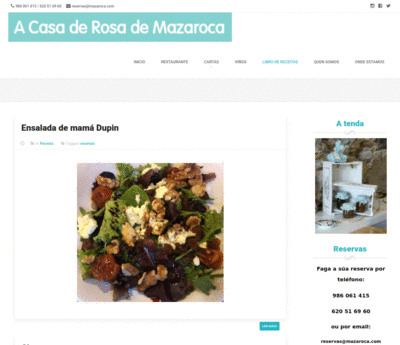
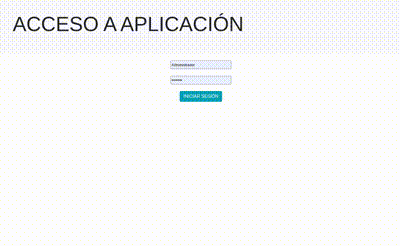
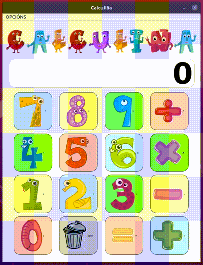

# </> AboutMe
Una pequeña reseña... under construction

- 👋 Hi, I’m @miguellopezpatricio and I'm a fullstack developer
- 👀 I’m interested in music, movies, literature and, of course, programming
- 🌱 I’m currently learning Spring and React
- 💞️ I’m looking to collaborate on new and exciting projects
- 📫 How to reach me: ml.patri@gmail.com and @MLPatri

<!---
miguellopezpatricio/miguellopezpatricio is a ✨ special ✨ repository because its `README.md` (this file) appears on your GitHub profile.
You can click the Preview link to take a look at your changes.
--->

## Skills

 

 

 

## Other skills...
;-)

## Puedes ver algunos de mis trabajos visitando mis repositorios

### Webs en WordPress

## Apps 

## Fun

### Contacta conmigo
mail - twitter - linkedIn